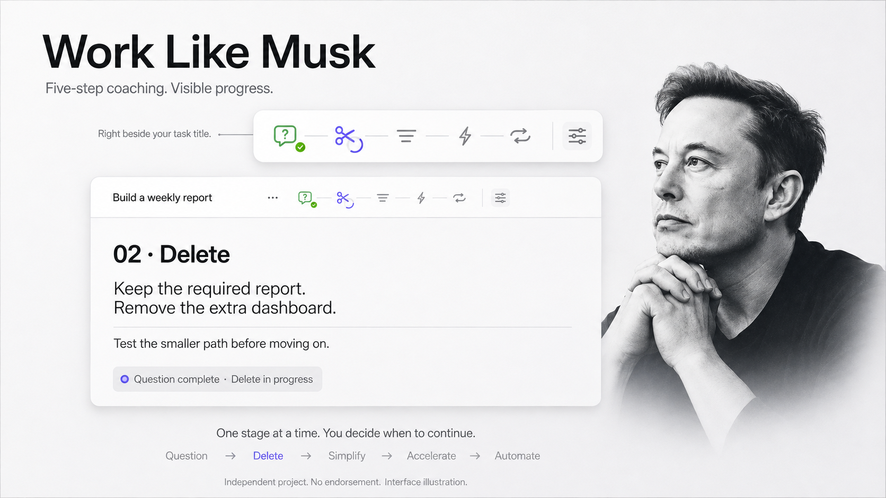

<p align="center"><a href="README.md">English</a> · <strong>简体中文</strong></p>



<p align="center"><strong>让 AI 带着教练的判断力，陪你把项目一步步做好。</strong></p>
<p align="center">
  <a href="LICENSE"></a>
  <a href="skills/work-like-musk/SKILL.md"></a>
  <a href="docs/hud.zh-CN.md"></a>
</p>

**Work Like Musk** 用 **质疑需求 → 删除 → 简化 → 加速 → 自动化** 指导 AI 开展项目。在投入工作前，AI 会审视自己的方案，解释一条具体建议，付诸行动，再用结果检验判断。

**默认每完成一步，都等你回应。** 需要时，你也可以明确要求连续推进。

## 为什么使用它？

- **尽早发现多余工作。** 先追问需求为什么存在，再围绕它实现。
- **看懂背后的判断。** 每条关键建议都有理由、下一步行动和验证方式。
- **自己掌握节奏。** 当前步骤完成后，下一步保持待开始，直到你继续。
- **知道“完成”意味着什么。** 最终回复保留工作范围、证据、未解决的问题和下一步。

## 安装

通过 [Skills CLI](https://github.com/vercel-labs/skills) 安装到 Codex：

```sh
npx skills add DiyunZ/work-like-musk --skill work-like-musk --agent codex --global --copy --yes
```

使用其他受支持的 agent 时，去掉 `--agent codex --yes`，按提示选择。核心是 Markdown Skill；原生 HUD 为可选功能，需要单独安装。本项目以 Codex 为开发和验证环境，其他宿主的表现取决于其 Skill 支持和指令规则。

也可以手动把 [`skills/work-like-musk`](skills/work-like-musk) 复制到 agent 的 Skill 目录。Codex 默认的个人安装位置为 `~/.codex/skills/work-like-musk/`。安装后新建任务，让它发现新 Skill。

## 开始使用

```text
$work-like-musk
帮我做一个把 CSV 文件转换为周报的小工具。
每次指导并完成一个步骤，等我回应后再进入下一步。
```

AI 首先明确真实目标，以及 **质疑需求** 这一步的验收条件。它可以在当前阶段检查项目、执行已授权的工作。针对当前结果的追问不会自动开启后续阶段。

一次阶段收尾可以这样表达：

> **01 · 质疑需求 — 已完成**
>
> 当前需要的是从一个 CSV 生成一份本地报告。仪表盘和定时服务属于实现选择，先验证它们有没有必要，再决定是否实现。
>
> **证据：** 已明确输出、输入格式和验收方式；尚未验证运行效果。
>
> **下一步：** 检查哪些部分可以删除。第 02–05 步仍待开始。回复“继续删除步骤”后推进。

这是虚构的指导示例，用于展示预期表达方式，不是 Musk 原话或真实用户对话。

## 五个步骤，每一步都有推进依据

| 步骤 | 核心问题 | 需要寻找的证据 |
| --- | --- | --- |
| **01 质疑需求** | 这个需求解决什么问题？ | 明确的目标、来源、约束和验收方式。 |
| **02 删除** | 这个部分能完全去掉吗？ | 可恢复的试验，证明可以删除或应当保留。 |
| **03 简化** | 完整实现目标的最小路径是什么？ | 可用的端到端结果，以及必要检查。 |
| **04 加速** | 时间到底花在哪里？ | 观察到的瓶颈，以及相关指标的前后对比。 |
| **05 自动化** | 这件事值得自动重复吗？ | 稳定的操作、值得投入的收益和经过验证的失败处理。 |

新证据推翻旧判断时，Skill 会重开较早的步骤。设计层面的勾选只表示设计进展；运行效果需要实际运行证据。超出本次范围的阶段保持待开始。五步法用于做决策，不要求凭空凑出五项修改。

## 选择你的节奏

| 你希望…… | 可以这样说 |
| --- | --- |
| 每步停下来 **（默认）** | “完成这一步，说明证据，然后等我。” |
| 连续推进 | “各步骤之间不用等待，最后保留每一步的结论和证据。” |
| 自己练习判断 | “一次只问我一个问题，让我自己推理。” |
| 只要指导，不开 HUD | “使用这个 Skill，但不要显示进度面板。” |

可以用中文或英文交流，指导会跟随对话语言。`SKILL.md` 本身使用英文。

## 可选：实时 macOS HUD

配套应用将 AI 报告的阶段显示在当前 Codex 任务标题旁，也提供浮动显示和菜单栏回退。支持中英文、按任务隔离的进度、悬停说明和外观设置。

- 旋转圆环表示正在执行；红色呼吸圆点表示正在等你发出下一步指令。
- 完成标记跟随 AI 提供的证据和阶段收尾，面板本身不会独立验证项目。
- 使用本地文件和原生应用。HUD 代码不需要网络服务或 API key。

需要 **macOS 14+、Python 3.9+ 和 Apple Swift 命令行工具**。先安装 Skill，再运行：

```sh
git clone https://github.com/DiyunZ/work-like-musk.git
cd work-like-musk
python3 scripts/build.py
python3 scripts/install.py --language zh-CN
```

英文界面使用 `--language en`。安装器默认更新 Codex 的个人 Skill 目录；其他位置可用 `--skill` 指定。被替换的文件会先备份。应用在本机编译并作临时签名，本仓库不提供经过 Apple 公证的二进制发行版。

标题跟随和恢复方法见 [HUD 安装、权限与故障排查](docs/hud.zh-CN.md)。Codex 适配依赖本地桌面任务元数据，可能需要随 Codex 更新而调整。

## 仓库内容

```text
skills/work-like-musk/   Installable skill, protocol guide, and state CLI
native/                 Optional SwiftUI/AppKit HUD
scripts/                Build, HUD installer, preview, and native test runner
tests/                  State, installer, and native regression checks
docs/                   HUD guide and original English artwork
```

在 macOS 上执行实现检查：

```sh
python3 -m unittest discover -s tests -p 'test_*.py' -v
python3 scripts/test_native.py
python3 scripts/build.py
```

这些检查验证实现行为，不代表已证明普遍的效率提升，也不保证 agent 每次都完全遵循 Skill。详见 [验证范围](docs/verification.md) 和 [贡献指南](CONTRIBUTING.md)。

## 来源与许可

五步顺序来自 [Everyday Astronaut 对 2021 年 Elon Musk 访谈的总结](https://everydayastronaut.com/starbase-tour-and-interview-with-elon-musk/)。指导循环、阶段停顿、证据规则及 agent 集成为本项目的改编。

本项目独立开发，与 Elon Musk、其公司或 OpenAI 无隶属或代言关系。[MIT 许可](LICENSE) 在权利存在的范围内适用于项目材料，不授予第三方姓名、肖像或代言权。海报为 [原创 AI 生成的编辑风格插画](docs/assets/artwork.md)。README 借鉴了 [Archify](https://github.com/tt-a1i/archify) 清晰的视觉介绍和语言切换方式，未复用其素材或文案。
